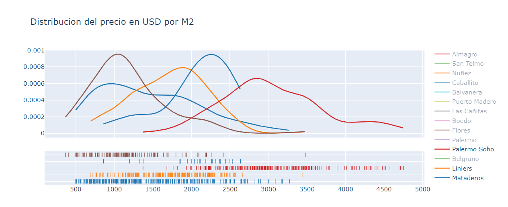

# Prediccion Precios Propiedades

Las Notebooks presentadas en este proyecto contienen un analisis exploratorio y predictivo sobre el precio en dolares por metro cuadrado de una muestra de propiedades. Estos datos provienen de la inmobiliaria Properatti.

Se realizo un profundo analisis sobre valores atipicos utilizando estadistica descriptiva y visualizacion.

El proposito de la limpieza del Data Set es a los efectos de poder estimar un modelo de *regresion lineal* para obtener los estimadores que mejor se ajusten y asi predecir los precios en dolares por metro cuadrado.

# Incluye

<ui>

<li>
Extraccion, Transformacion y Carga de Datos.
</li>

<li>
Limpieza del Data Set
</li>

<li>
Graficos Dinamicos y Estaticos.
</li>

<li>
Regresion Lineal Multiple
</li>

</ui>

# Librerias

<ui>

<li>
{Matplotlib}
</li>

<li>
{Seaborn}
</li>

<li>
{Scikit-Learn}
</li>

</ui>

# Visualizaciones

**Distribucion**

  

**3D Plot**

  

# Datos

[properatti.csv](https://drive.google.com/file/d/1q25gqE943_Rhq9ejUrAVQSC-m3-O6XGF/view?usp=sharing)

